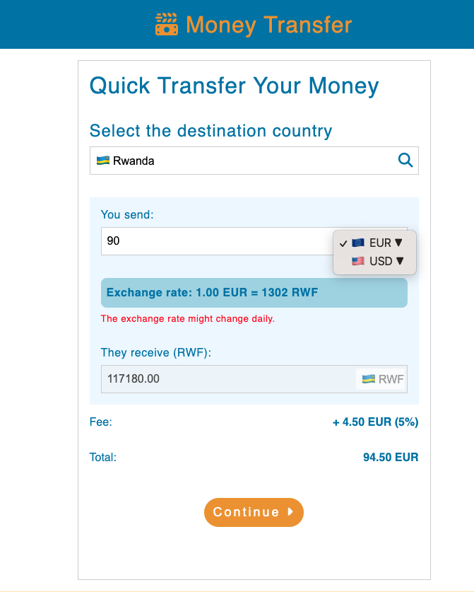
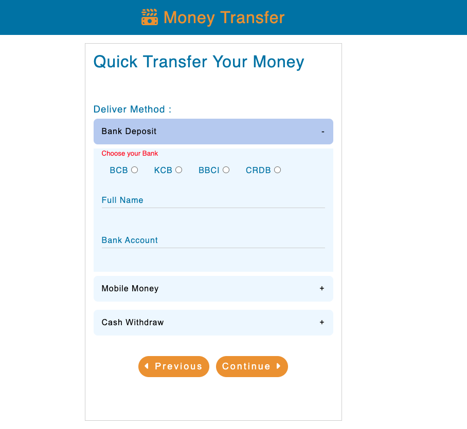
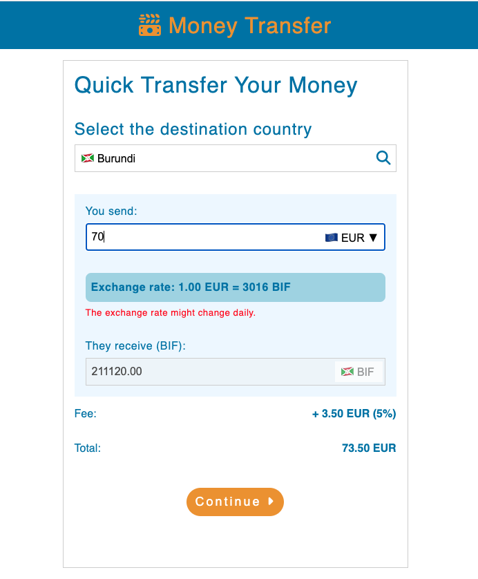
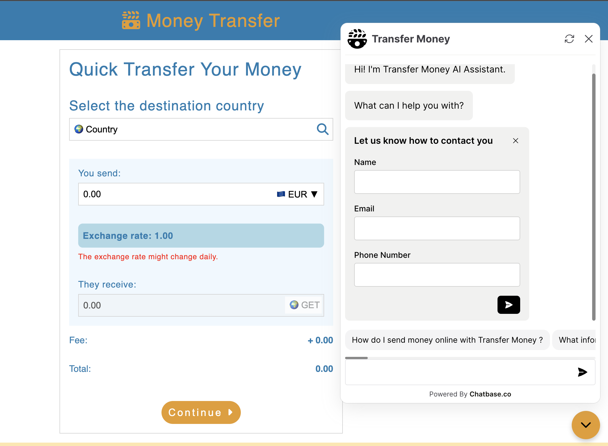
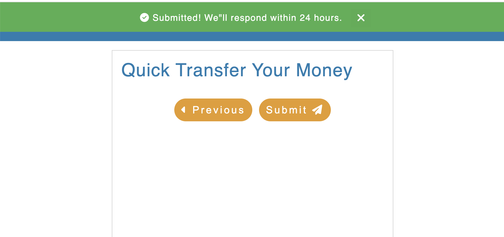
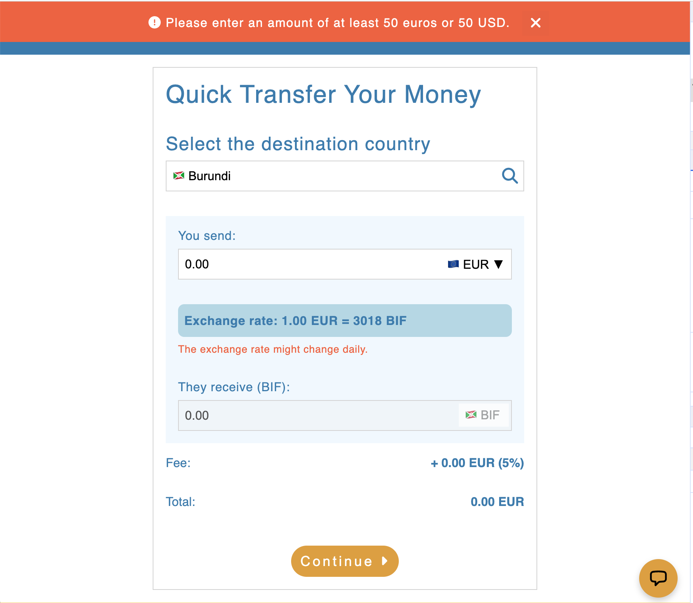
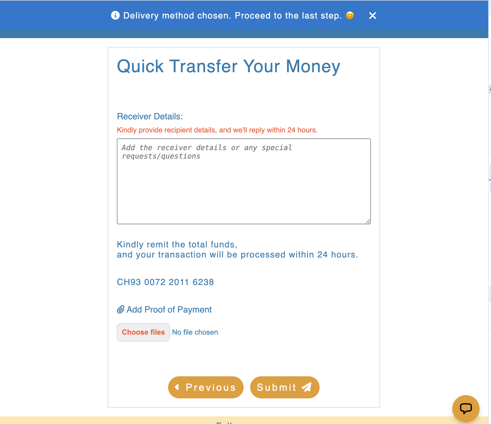
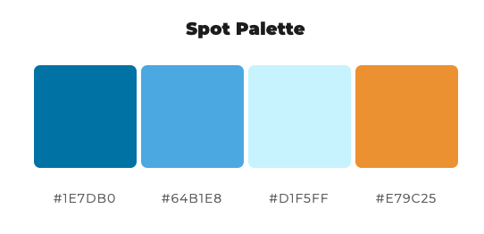

# Money Transfer Financial Platform

Welcome to the Money Transfer Financial Platform, a dedicated solution tailored to the diaspora community. This platform simplifies the process of sending money to loved ones in Burundi and Rwanda, while providing real-time exchange rate information, ensuring that both senders and recipients have full visibility into their financial transactions. 

## Table of Contents

1. [Getting Started](#getting-started)
2. [Features](#features)
3. [Troubleshooting](#troubleshooting)
4. [Contributor Guidelines](#contributor-guidelines)
5. [Environment Setup](#environment-setup)
6. [Architecture Insight](#architecture-insight)
7. [User Goals](#user-goals)
8. [UX Stories](#ux-stories)
9. [Color Palette](#color-palette)
10. [Testing](#testing)
11. [Deployment](#deployment)
12. [Improvements](#improvements)
13. [Credits](#credits)
14. [Key topics covered here in JavaScript](#key-topics-covered-here-in-javascript)
15. [Acknowledgements](#acknowledgements)
16. [Codeanywhere Reminders](#codeanywhere-reminders)
17. [FAQ](#faq)

## Getting Started

Follow these steps to get the Money Transfer Financial Platform up and running on your local machine.

1. Clone this repository to your local machine: git clone https://github.com/cedricntwari/money-transfer.git. 

2. Navigate to the project directory: cd money-transfer.
3. Open the `index.html` file in your preferred web browser.

## Features

This platfrom offers a range of services: 

- **Currency Conversion:** Using exchange rates, this code enables users to convert a certain sum between different currencies. The user can choose the country of destination then enter the desired amount ("You Send"), and see the desired currency ("They Receive"). The amount the recipient will receive is determined by the code using currency rates, and it is displayed in the "They Receive" input area.

- **Flexible payment options:** such as local bank deposit, mobile money via local Apps, and cash withdrawal for delivery methods.

- **Fee Calculation:** A fee is computed by the code based on the amount and selected currency that the user wishes to transmit. The chosen currency (for example, EUR, USD, BIF, or RWF) determines the fee percentage. The charge amount is shown to the user as a percentage of the "You Send" amount as well as a numeric value.

- **Real-time Updates:** As the user enters data into the input fields, the code updates in real-time. For instance, the "They Receive" amount, fee, and total amount are all instantly recalculated and displayed whenever the user modifies the "You Send" amount or chooses a different currency.

- **User Interface Interactions:** The code contains event listeners for a variety of user activities, such as clearing the "You Send" field by clicking on it, confirming the user's selection of a destination nation, and updating the UI when the user modifies the available currencies.

- **Chatbase Chatbot:** A chatbot build by Chatbase,an AI chatbot builder that trains ChatGPT with this web APP data.
The Chatbase chatbot is designed to provide real-time assistance, answer your questions, and offer support related to our services.

   - How to access the Chatbot
   The user can access the Chatbase chatbot by clicking the chat icon located in the bottom-right corner of the website. The chatbot is active to assist users 24/7, making it easier than ever to get the help that users need.

   - Chatbot Functionality

    This Chatbase chatbot can help with a wide range of inquiries and tasks, including:

   - Providing information about our money transfer services.
   - Answering questions about exchange rates and fees.
   - Assisting with troubleshooting and common issues.
   - Offering guidance on using our platform effectively.

- **Notifications:** In order to achieve a good user experience, Notications are included to offer users a good guidance, provide immediate feedback and confirmation while using this Platform. Success messages confirm that a task has been completed successfully, giving users confidence in their interactions with the system. Error messages alert users to issues or mistakes they've made during their interactions.

This proactive approach helps in error prevention and minimizes frustration.

    - Success Message: If users have successfully completed an action or a process, a success message is displayed to inform users.
    - Error Message: If users didn’t complete an action or left empty required input, an error message is displayed to inform users.
    - Informative Message: To keep users informed and offer guidance on their interactions with the platform, ensuring a positive and informed user experience

## Troubleshooting

If you encounter any issues or errors while using the Money Transfer Financial Platform, please get in touch ntwaricedric@gmail.com.
s
## Contributor Guidelines

 I welcome contributions from the community to improve and expand the Money Transfer Financial Platform. If you'd like to contribute, please get in touch ntwaricedric@gmail.com.

## Environment Setup

Before working on the project, make sure you have the following tools and dependencies installed:

- [Node.js](https://nodejs.org/)
- [npm](https://www.npmjs.com/)

Install the project dependencies using: npm install

## Architecture Insight

The Money Transfer Financial Platform follows a modular architecture and is built with HTML, CSS and JavaScript.

### Technologies used

 - Google Fonts https://fonts.google.com/ 
 - Font Awesome https://fontawesome.com/ 
 - Chrome Dev tools
 - Github
 - Git

## User Goals

**User**
- **Currency Exchange:** New users can easily exchange their currency for another at real-time rates.
- **Send Money Abroad:** Initiate international money transfers.
- **Understand Fees:** Understand the fees associated with the money transfer.

## UX Stories

**User Stories:**

- As a first-time user, I want a simple and intuitive interface to easily understand how to send money abroad.
- As a frequent traveler, I want quick access to real-time exchange rates, so I can make informed decisions on when to transfer money.
- As a recipient of international transfers, I want transparency throughout the process to track the status of my incoming funds.
- As a security-conscious user, I expect robust security measures in place to safeguard my financial information.
- As a mobile user, I want a responsive design that allows me to use the platform seamlessly on various devices.

**Business Goal Stories:**

- To attract and retain customers, we aim to provide a frictionless and trustworthy money transfer experience.
- We aspire to expand our user base by offering competitive exchange rates, attracting both individual and business users.
- Enhancing security features and ensuring data privacy are critical to building trust and maintaining the platform's reputation.
- A responsive design ensures accessibility for a broader audience, leading to increased usage and customer satisfaction.

With these UX stories, we aim to prioritize both the user's needs and the strategic goals of our platform.

## Color Palette

Inspired by the 100 CHF Swiss note, the color scheme is characterized by the following:

- **Primary Color:** [--primary-color: #1E7DB0]
- **Secondary Color:** [--secondary-color: #E79C25]

These colors reflect the elegance and sophistication of Swiss currency and create a visually appealing user experience.

## Testing

- Tested in different browser : Chrome, Firefox, Safari.
- This website is responsive and functions on all screen sizes using devtools device toolbar.
- All features works good, readable and easy to understand.

**Validator Testing**

- HTML
  - No errors were returned when passing through the official [W3C validator](https://validator.w3.org/nu/#textarea)
- CSS
  - No errors were found when passing through the official [(Jigsaw) validator](https://jigsaw.w3.org/css-validator/#validate_by_input)
- Accessibility:
    - No errors were found when passing through web dev tool lighthouse
- JavaScript: 
    - No errors were found when passing through the official [(Jshint) validator](https://jshint.com/)

## Deployment

This project is hosted hosting platform on GitHub.

- The site is deployed to GitHub pages.
- The live link can be found here: <https://cedricntwari.github.io/money-transfer/>.

## Improvements

- **Currency Exchange API Integration (Future Development):** Expanding the currency exchange API integration to include all countries and currencies worldwide.

## Credits

In the development of this project, I've used resources like the W3Schools website to learn and implement key web development concepts.

Additionally, I'd like to give credit to the creators of the currency API for providing valuable currency exchange rate data for this project. Kudos to them for their contribution.

- [Currency API](https://github.com/fawazahmed0/currency-api)
- [Collapsibles/Accordion](https://www.w3schools.com/howto/howto_js_accordion.asp)
- [Form with Multiple Steps](https://www.w3schools.com/howto/howto_js_form_steps.asp)
- [Color, spot Palette](https://mycolor.space/?hex=%231E7DB0&sub=1sp)

- **Note:** 
    working with a multi-step form, using the HTML 'required' attribute alone on input fields does not provide the desired validation behavior. I have implemented custom validation logic to ensure data integrity in the context of a multi-step form. https://community.glideapps.com/t/multi-step-form-validation-does-not-work/59531 

## Key topics covered here in JavaScript

JavaScript code demonstrates a solid understanding of several core web development principles and techniques:

- DOM Manipulation
- Event Handling
- Form Handling
- Accordion Functionality
- Data Structures
- Functions
- Conditional Statements
- Loops
- Variable and Data Types
- Error Handling
- ES6 Modules (Import and Export)
- Version Control (Git)

## Acknowledgements

I would like to express my gratitude to my mentor,Adegbenga Adeye, the Code Institute, and everyone who has supported me on my journey to becoming a full-stack software developer. The warmth and encouragement I've received have been truly wonderful. Thank you!

## Codeanywhere Reminders

To run a frontend (HTML, CSS, Javascript only) application in Codeanywhere, in the terminal, type:

`python3 -m http.server`

A button should appear to click: _Open Preview_ or _Open Browser_.

To run a frontend (HTML, CSS, Javascript only) application in Codeanywhere with no-cache, you can use this alias for `python3 -m http.server`.

## FAQ

If you have additional questions or need further assistance, please don't hesitate to contact our support team at ntwaricedric@gmail.com.

Happy using the Money Transfer Financial Platform!

