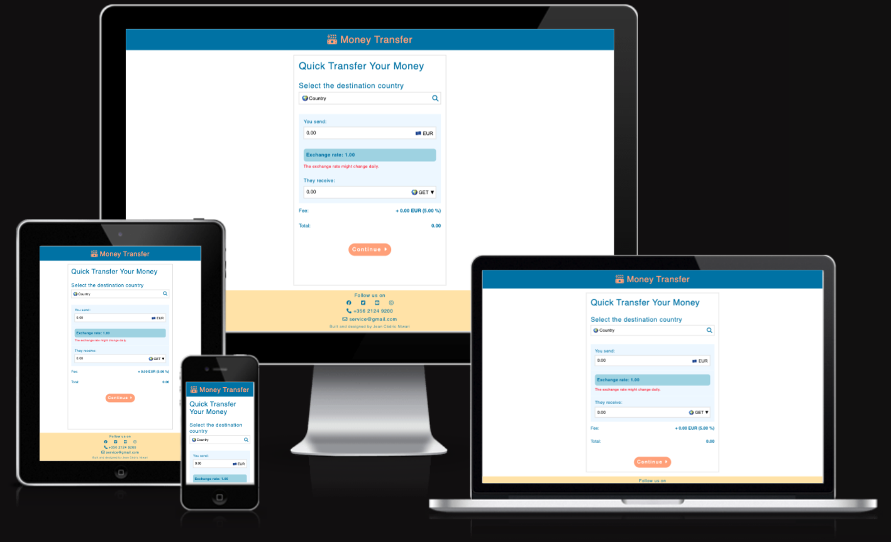

# Money Transfer Financial Platform

Welcome to the Money Transfer Financial Platform, a solution for all your currency exchange and money transfer needs. This platform is designed to simplify the process of sending money across borders while providing real-time exchange rate information, ensuring that both senders and recipients have full visibility into the transaction.

This platfrom offers a range of services: 
- **Currency Conversion:** Using exchange rates, this code enables users to convert a certain sum between different currencies. The user can choose the country of destination then enter the desired amount ("You Send"), and see the desired currency ("They Receive"). The amount the recipient will receive is determined by the code using currency rates, and it is displayed in the "They Receive" input area.

- **Various payment options:** such as bank deposit, mobile money via an app, and cash withdrawal for delivery methods.

- **Fee Calculation:** A fee is computed by the code based on the amount and selected currency that the user wishes to transmit. The chosen currency (for example, EUR, USD, BIF, or RWF) determines the fee percentage. The charge amount is shown to the user as a percentage of the "You Send" amount as well as a numeric value.

- **Real-time Updates:** As the user enters data into the input fields, the code updates in real-time. For instance, the "They Receive" amount, fee, and total amount are all instantly recalculated and displayed whenever the user modifies the "You Send" amount or chooses a different currency.

- **User Interface Interactions:** The code contains event listeners for a variety of user activities, such as clearing the "You Send" field by clicking on it, confirming the user's selection of a destination nation, and updating the UI when the user modifies the available currencies.

## Table of Contents

1. [UX Stories](#ux-stories)
2. [Features](#features)
3. [Color Palette](#color-palette)
4. [Technologies](#technologies)
5. [Testing](#testing)
6. [Deployment](#deployment)
7. [Credit](#credit)
8. [Improvements](#improvements)
9. [Contributions](#contributions)
10. [Credit](#credit)
11. [Key topics covered here in JavaScript](#key-topics-covered-here-in-javaScript)
12. [Acknowledgements](#acknowledgements)
13. [Codeanywhere Reminders](#codeanywhere-reminders)

## User Goals

**User**
- **Currency Exchange:** New users can easily exchange their currency for another at real-time rates.
- **Send Money Abroad:** Initiate international money transfers.
- **Understand Fees:** Understand the fees associated with the money transfer.

## UX Stories

**User Stories:**

- As a first-time user, I want a simple and intuitive interface to easily understand how to send money abroad.
- As a frequent traveler, I want quick access to real-time exchange rates, so I can make informed decisions on when to transfer money.
- As a recipient of international transfers, I want transparency throughout the process to track the status of my incoming funds.
- As a security-conscious user, I expect robust security measures in place to safeguard my financial information.
- As a mobile user, I want a responsive design that allows me to use the platform seamlessly on various devices.

**Business Goal Stories:**

- To attract and retain customers, we aim to provide a frictionless and trustworthy money transfer experience.
- We aspire to expand our user base by offering competitive exchange rates, attracting both individual and business users.
- Enhancing security features and ensuring data privacy are critical to building trust and maintaining the platform's reputation.
- A responsive design ensures accessibility for a broader audience, leading to increased usage and customer satisfaction.

With these UX stories, we aim to prioritize both the user's needs and the strategic goals of our platform.

## Features

**1. Real-time Exchange Rates:** Access real-time exchange rate information for various currencies, including EUR, USD, BIF, and RWF, to facilitate the user to make an informed decisions for your financial transactions.

**2. Multiple Step Money Transfer:** The transfer process has been simplified into easy-to-follow steps, ensuring a seamless and secure experience.

**3. Accordions for Easy Navigation:** The user-friendly interface incorporates accordions for a smooth and intuitive navigation experience.

**4. Navigation & Footer for Quick Access:** A well-designed navigation & footer with essential links and information, allowing users to quickly navigate to the home page of the platform and our social platforms and customer support.

**5. Robust Security:** The platform employs security measures to safeguard your financial data and protect your privacy. We adhere to industry-standard for basic security protocols to ensure your peace of mind.

## Color Palette

Inspired by the 100 CHF Swiss note, the color scheme is characterized by the following:

- **Primary Color:** [--primary-color: #1E7DB0]
- **Secondary Color:** [--secondary-color: #ffaa80]

These colors reflect the elegance and sophistication of Swiss currency and create a visually appealing user experience.

## Technologies

- **Frontend:** We use a combination of HTML, CSS, and JavaScript to deliver a responsive and visually appealing user interface.

## Testing

- Tested in different browser : Chrome, Firefox, Safari.
- This website is responsive and functions on all screen sizes using devtools device toolbar.
- All features works good, readable and easy to understand.

**Validator Testing**

- HTML
  - No errors were returned when passing through the official [W3C validator](https://validator.w3.org/nu/#textarea)
- CSS
  - No errors were found when passing through the official [(Jigsaw) validator](https://jigsaw.w3.org/css-validator/#validate_by_input)
- Accessibility:
    - No errors were found when passing through web dev tool lighthouse
- JavaScript: 
    - No errors were found when passing through the official [(Jshint) validator](https://jshint.com/)

## Deployment

This project is hosted hosting platform on GitHub.

- The site is deployed to GitHub pages.
- The live link can be found here: <https://cedricntwari.github.io/money-transfer/>.

## Improvements

- **Currency Exchange API Integration (Future Development):** One of the upcoming enhancements for this platform is the integration of a currency exchange API. This integration will provide users with real-time and up-to-date currency exchange rates, ensuring that you have access to the most accurate information when sending money across borders.

## Credits

In the development of this project, I've used resources like the W3Schools website to learn and implement key web development concepts

- [Collapsibles/Accordion](https://www.w3schools.com/howto/howto_js_accordion.asp)
- [Form with Multiple Steps](https://www.w3schools.com/howto/howto_js_form_steps.asp)

## Key topics covered here in JavaScript

JavaScript code demonstrates a solid understanding of several core web development principles and techniques:

- DOM Manipulation
- Event Handling
- Form Handling
- Accordion Functionality
- Data Structures
- Functions
- Conditional Statements
- Loops
- Variable and Data Types
- Error Handling
- ES6 Modules (Import and Export)
- Version Control (Git)

## Acknowledgements

I would like to express my gratitude to my mentor,Adegbenga Adeye, the Code Institute, and everyone who has supported me on my journey to becoming a full-stack software developer. The warmth and encouragement I've received have been truly wonderful. Thank you!

## Codeanywhere Reminders

To run a frontend (HTML, CSS, Javascript only) application in Codeanywhere, in the terminal, type:

`python3 -m http.server`

A button should appear to click: _Open Preview_ or _Open Browser_.

To run a frontend (HTML, CSS, Javascript only) application in Codeanywhere with no-cache, you can use this alias for `python3 -m http.server`.

